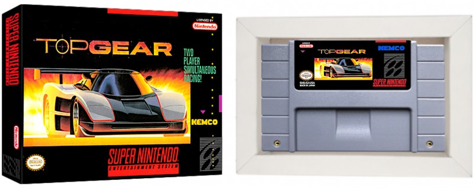

# 🏁 Página de Fã: Top Gear (SNES)

Este projeto foi desenvolvido como solução para o desafio "Recriando a Wikipedia" do Módulo 3 da Trilha de HTML. 
O objetivo era criar uma página de artigo informativo, aplicando conceitos avançados de estrutura, semântica e acessibilidade.

O tema escolhido foi o clássico jogo de corrida **Top Gear** para Super Nintendo. 
A página é uma "single-page application" (SPA) que serve como um tributo informativo e nostálgico ao jogo, com um layout moderno e diversas interatividades.



---

## ✨ Funcionalidades

O projeto vai além do básico e inclui diversas funcionalidades modernas:

-   **Layout Responsivo:** Totalmente adaptado para visualização em desktops, tablets e celulares.
-   **Estrutura Semântica com HTML5:** Uso de tags como `<header>`, `<main>`, `<article>`, `<section>`, `<aside>` e `<footer>` para melhor acessibilidade e SEO.
-   **Galeria de Imagens com Lightbox:** Todas as imagens podem ser clicadas e ampliadas para uma melhor visualização.
-   **Animações Dinâmicas:** As seções da página possuem uma animação de "fade-in" suave conforme o usuário rola a página.
-   **Easter Egg (Konami Code):** Um segredo para os fãs de jogos clássicos! Ao digitar o Konami Code (`↑↑↓↓←→←→BA`), um alerta é exibido.
-   **Navegação Suave (Smooth Scroll):** Os links do menu de navegação rolam suavemente até a seção correspondente.
-   **Vídeo do YouTube Embutido:** Um player de vídeo com a trilha sonora do jogo.

---

## 🛠️ Tecnologias Utilizadas

-   **HTML5** (Semântico)
-   **CSS3** (Flexbox, Variáveis, Animações, Media Queries)
-   **JavaScript (Vanilla JS)**
-   **SimpleLightbox** (Biblioteca JavaScript para a galeria de imagens)

---

## 🚀 Como Executar o Projeto

Nenhum pré-requisito complexo é necessário, apenas um navegador de internet.

1.  **Clone o repositório:**
    ```bash
    git clone https://github.com/welitonrangel/trilha-html-modulo-3.git
    ```

2.  **Navegue até a pasta do projeto:**
    ```bash
    cd trilha-html-modulo-3
    ```

3.  **Abra o arquivo `index.html`:**
    Basta abrir o arquivo `index.html` diretamente no seu navegador preferido.

---

## 🎯 Objetivo do Desafio

O objetivo principal era praticar a estruturação de uma página com HTML semântico, aplicar estilização com CSS para criar um layout superior ao de uma página wiki tradicional, e garantir boas práticas de acessibilidade, tornando a página navegável por tecnologias assistivas como o NVDA.

```
## 👨‍💻 Autor

Feito por **Weliton Rangel**.
